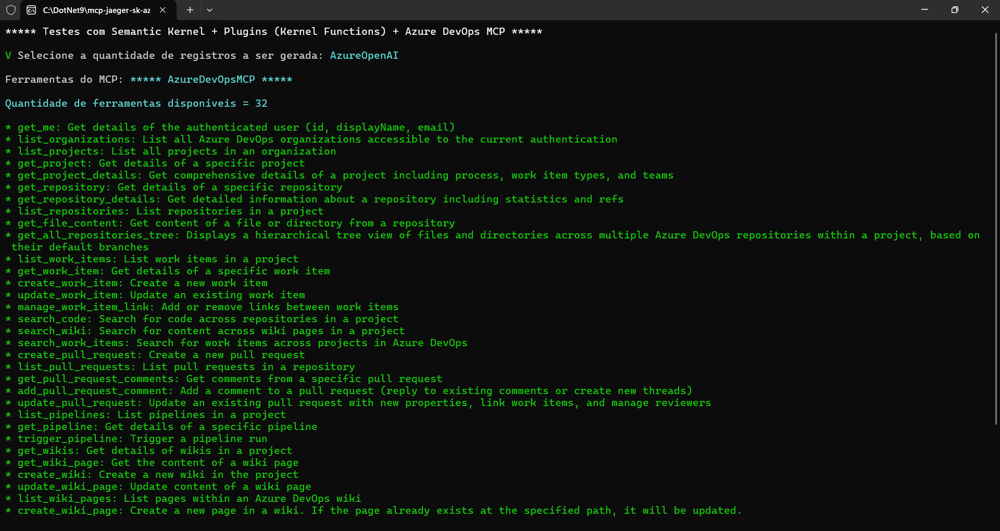
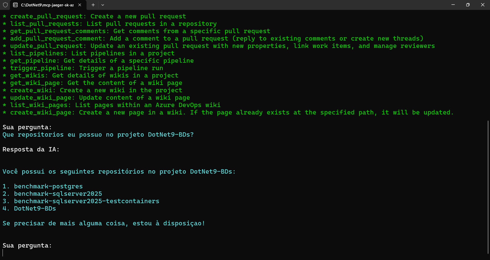
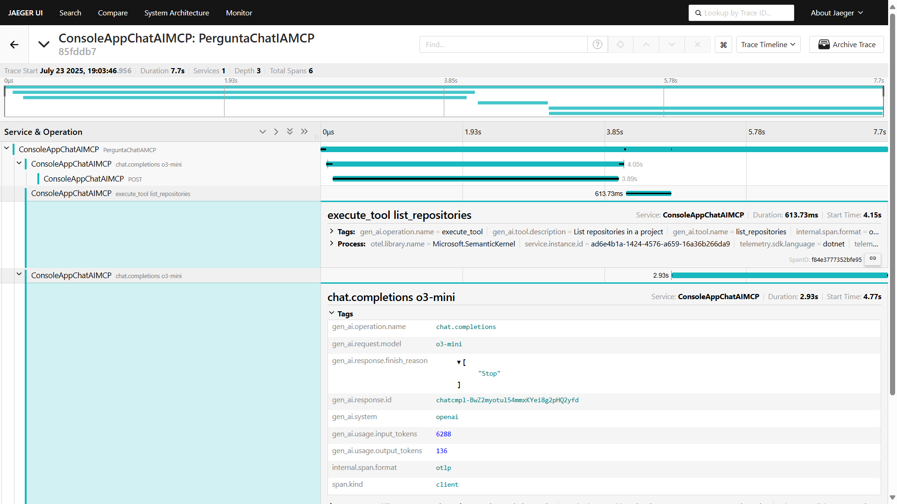
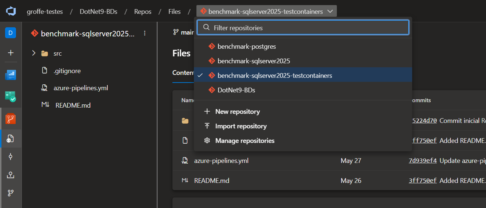

# dotnet9-semantickernel-otel-jaeger-mcp-azuredevops_chat
Exemplo em .NET 9 de Console Application que faz uso do projeto Semantic Kernel, com integração com soluções de IA como Azure Open AI e Ollama na interação com um servidor MCP - utilizei o Azure DevOps MCP para testes. Inclui Docker Compose para criação do ambiente de testes com os serviços de monitoramento do Jaeger + OpenTelemetry.

MCP Server utilizado:
* https://www.npmjs.com/package/@tiberriver256/mcp-server-azure-devops

---

## Testes com a aplicação

Ferramentas que integram o MCP:

Teste de uso do MCP:

Trace gerado e visualizado a partir da interface do Jaeger:

Repositórios no Azure DevOps confirmando que a resposta gerada via IA está correta:

